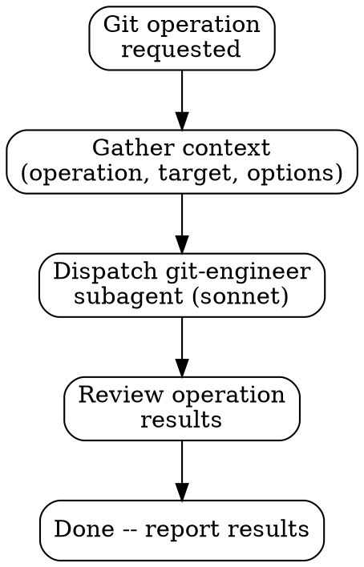

# Git Skill

## Overview

Orchestrates the **git-engineer** subagent to perform git operations such as commits, branching, merging, rebasing, stashing, log analysis, and worktree management.

## When to Use

- When the user wants to commit changes
- When branches need to be created, switched, or cleaned up
- When merges or rebases are needed
- When stashing or unstashing work
- When analyzing commit history or comparing branches
- When managing worktrees -- use `bundle exec bin/worktree create/remove/list` instead of raw `git worktree` commands
- **Do NOT use** for GitHub operations (PRs, issues, releases)

## Workflow

## How to Invoke

The main agent follows these steps:

### Step 1: Gather Context

Identify from the user's request:

- **Operation:** commit, branch, merge, rebase, stash, log/diff, or worktree
- **Target:** what files, branches, or commits are involved
- **Options:** any specific flags, messages, or preferences the user mentioned

For **worktree operations** (create, remove, list), use the project's `bin/worktree` CLI tool which handles dependency installation and local gem symlinking automatically.

### Step 2: Dispatch the Git Engineer

Use the `Task` tool with `subagent_type: "git-engineer"`. Include in the prompt:

- The operation to perform
- Any specific targets (files, branches, commit ranges)
- User preferences (commit message hints, branch naming, etc.)
- Any relevant context about what the user has been working on

### Step 3: Review Output

After receiving the git-engineer's output:

- Verify the operation completed successfully
- Check for any warnings or conflicts reported
- Note the current repository state

### Step 4: Report to User

Summarize:

- What git operation was performed
- What changed (files staged, commits created, branches switched, etc.)
- Current repository state
- Any warnings or follow-up actions needed
